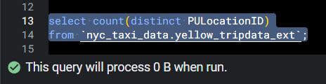
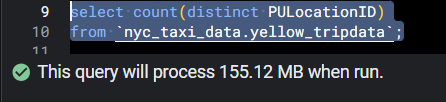
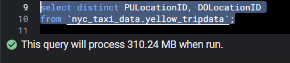
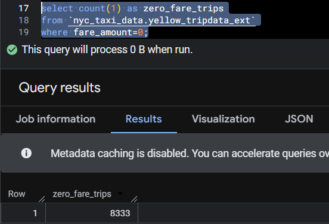
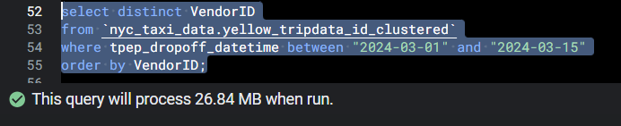
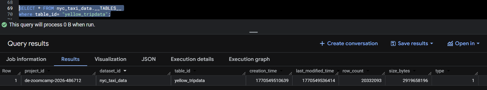

# Module 3 Homework: Data Warehousing & BigQuery

## BigQuery DDL and Loads

```sql
-- Creating a materialized table in BigQuery (non-partitioned table)
CREATE TABLE IF NOT EXISTS `nyc_taxi_data.yellow_tripdata`
(
    VendorID INTEGER OPTIONS (description = 'A code indicating the LPEP provider that provided the record. 1= Creative Mobile Technologies, LLC; 2= VeriFone Inc.'),
    tpep_pickup_datetime TIMESTAMP OPTIONS (description = 'The date and time when the meter was engaged'),
    tpep_dropoff_datetime TIMESTAMP OPTIONS (description = 'The date and time when the meter was disengaged'),
    passenger_count INTEGER OPTIONS (description = 'The number of passengers in the vehicle. This is a driver-entered value.'),
    trip_distance FLOAT64 OPTIONS (description = 'The elapsed trip distance in miles reported by the taximeter.'),
    RatecodeID INTEGER OPTIONS (description = 'The final rate code in effect at the end of the trip. 1= Standard rate 2=JFK 3=Newark 4=Nassau or Westchester 5=Negotiated fare 6=Group ride'),
    store_and_fwd_flag STRING OPTIONS (description = 'This flag indicates whether the trip record was held in vehicle memory before sending to the vendor, aka "store and forward," because the vehicle did not have a connection to the server. TRUE = store and forward trip, FALSE = not a store and forward trip'),
    PULocationID INTEGER OPTIONS (description = 'TLC Taxi Zone in which the taximeter was engaged'),
    DOLocationID INTEGER OPTIONS (description = 'TLC Taxi Zone in which the taximeter was disengaged'),
    payment_type INTEGER OPTIONS (description = 'A numeric code signifying how the passenger paid for the trip. 1= Credit card 2= Cash 3= No charge 4= Dispute 5= Unknown 6= Voided trip'),
    fare_amount FLOAT64 OPTIONS (description = 'The time-and-distance fare calculated by the meter'),
    extra FLOAT64 OPTIONS (description = 'Miscellaneous extras and surcharges. Currently, this only includes the $0.50 and $1 rush hour and overnight charges'),
    mta_tax FLOAT64 OPTIONS (description = '$0.50 MTA tax that is automatically triggered based on the metered rate in use'),
    tip_amount FLOAT64 OPTIONS (description = 'Tip amount. This field is automatically populated for credit card tips. Cash tips are not included.'),
    tolls_amount FLOAT64 OPTIONS (description = 'Total amount of all tolls paid in trip.'),
    improvement_surcharge FLOAT64 OPTIONS (description = '$0.30 improvement surcharge assessed on hailed trips at the flag drop. The improvement surcharge began being levied in 2015.'),
    total_amount FLOAT64 OPTIONS (description = 'The total amount charged to passengers. Does not include cash tips.'),
    congestion_surcharge FLOAT64 OPTIONS (description = 'Congestion surcharge applied to trips in congested zones'),
    Airport_fee FLOAT64 OPTIONS (description = 'Fee if picked-up from Airport')
);

-- Creating external table referring to GCS path
CREATE OR REPLACE EXTERNAL TABLE `nyc_taxi_data.yellow_tripdata_ext`
OPTIONS (
  format = 'PARQUET',
  uris = ['gs://gokhul-zoomcamp-kestra/yellow_tripdata_2024-*.parquet']
);

-- Loading normal materialized table with parquet files
LOAD DATA INTO `nyc_taxi_data.yellow_tripdata`
FROM FILES (
  format = 'PARQUET',
  uris = ['gs://gokhul-zoomcamp-kestra/yellow_tripdata_2024-*.parquet']
);

-- Create a partitioned table from external table
CREATE OR REPLACE TABLE `nyc_taxi_data.yellow_tripdata_partitioned`
PARTITION BY DATE(tpep_dropoff_datetime) AS
SELECT * FROM `nyc_taxi_data.yellow_tripdata_ext`;

-- Creating a partitioned and clustered table
-- Partitioned on: tpep_dropoff_datetime
-- Clustered on: VendorID
CREATE OR REPLACE TABLE `nyc_taxi_data.yellow_tripdata_id_clustered`
PARTITION BY DATE(tpep_dropoff_datetime)
CLUSTER BY VendorID AS
SELECT * FROM `nyc_taxi_data.yellow_tripdata_ext`;

-- Creating a partitioned and clustered table
-- Partitioned on: VendorID
-- Clustered on: tpep_dropoff_datetime
CREATE OR REPLACE TABLE `nyc_taxi_data.yellow_tripdata_date_clustered`
PARTITION BY RANGE_BUCKET(VendorID, GENERATE_ARRAY(0, 100, 1))
CLUSTER BY tpep_dropoff_datetime
AS
SELECT * FROM `nyc_taxi_data.yellow_tripdata_ext`;

-- Creating a table clustered on two columns
-- Clustered on: VendorID, tpep_dropoff_datetime
CREATE OR REPLACE TABLE `nyc_taxi_data.yellow_tripdata_date_id_clustered`
CLUSTER BY VendorID, tpep_dropoff_datetime
AS
SELECT * FROM `nyc_taxi_data.yellow_tripdata_ext`;
```

## Question 1. Counting records

What is count of records for the 2024 Yellow Taxi Data?

Answer: `20,332,093`.

```sql
SELECT count(*) AS row_count
FROM `nyc_taxi_data.yellow_tripdata`;
```

## Question 2. Data read estimation

Write a query to count the distinct number of PULocationIDs for the entire dataset on both the tables.

What is the **estimated amount** of data that will be read when this query is executed on the External Table and the Table?

Answer: `0 MB` for the External Table and `155.12 MB` for the Materialized Table.




## Question 3. Understanding columnar storage

Write a query to retrieve the PULocationID from the table (not the external table) in BigQuery. Now write a query to retrieve the PULocationID and DOLocationID on the same table.




Why are the estimated number of bytes different?

Answer: BigQuery is a columnar database and scans only the columns requested. Querying two columns (`PULocationID`, `DOLocationID`) reads more data than querying one column, so the estimate is higher.

## Question 4. Counting zero fare trips

How many records have a `fare_amount` of `0`?

Answer: `8,333`.



## Question 5. Partitioning and clustering

What is the best strategy to make an optimized table in BigQuery if your query will always filter based on `tpep_dropoff_datetime` and order the results by `VendorID`?

Answer: Partition by `tpep_dropoff_datetime` and cluster on `VendorID`.

Explanation: For date-based filtering, date-partitioned tables are optimal. When additionally clustered by `VendorID`, records within each partition are organized by vendor, improving sorting and query efficiency.

Other strategies considered:

Cluster on `tpep_dropoff_datetime` and cluster on `VendorID`. This does not add partitioning, so it does not reduce bytes scanned (observed 340 MB, same as a normal materialized table).

Cluster on `tpep_dropoff_datetime` and partition by `VendorID`. This is useful when filtering by `VendorID` and sorting by date.

Partition by `tpep_dropoff_datetime` and partition by `VendorID`. BigQuery does not allow partitioning by multiple columns.

## Question 6. Partition benefits

Write a query to retrieve the distinct `VendorID`s between `2024-03-01` and `2024-03-15` (inclusive).

Use the materialized table you created earlier in your `FROM` clause and note the estimated bytes. Now change the table in the `FROM` clause to the partitioned table you created for question 5 and note the estimated bytes processed. What are these values?




Answer: `310.24 MB` for the non-partitioned table and `26.84 MB` for the partitioned table.

## Question 7. External table storage

Where is the data stored in the External Table you created?

Answer: GCP Bucket.

The external table is a BigQuery reference to files stored in GCS (here, parquet files in a bucket).

## Question 8. Clustering best practices

It is best practice in BigQuery to always cluster your data:

Answer: `True`.

Partitioning and clustering based on filter and sort criteria is good practice. BigQuery can also auto-cluster based on query history.

## Question 9. Understanding table scans

No Points: Write a `SELECT count(*)` query from the materialized table you created. How many bytes does it estimate will be read? Why?


Answer: `0 Bytes`, because the count is served from table metadata.


